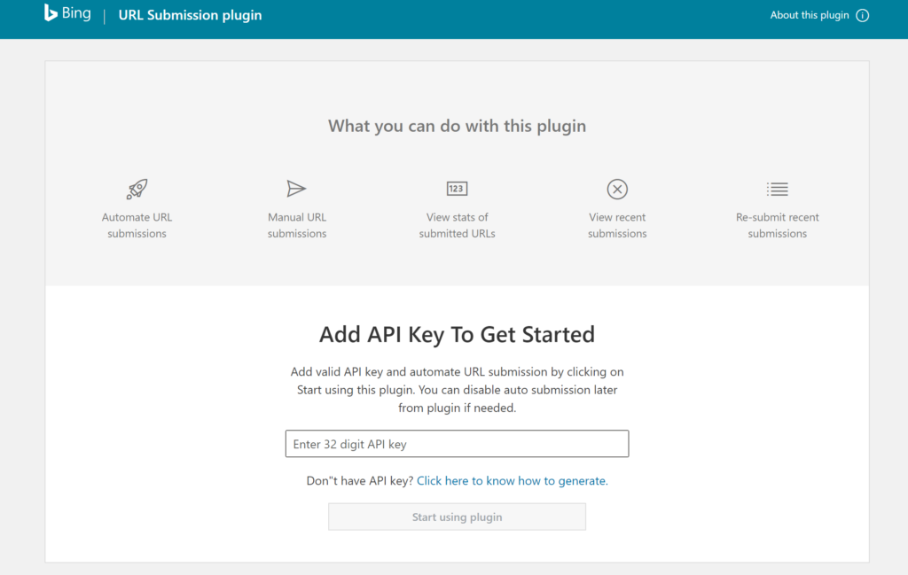

Cet article est basé sur un communiqué de [blogs.bing.com](https://blogs.bing.com/webmaster/july-2020/Get-your-WordPress-content-indexed-immediately-using-Bing-Webmaster-Tools-plugin) publié le 21 juin 2020.

## Nécessaire :

Il y a 2 prérequis pour pouvoir suivre ce tutoriel :

1. Avoir un Wordpress à jour et en posséder les droits d'administrations.
2. Avoir un compte _[Bing Webmaster Tools](http://bing.com/toolbox/webmaster?mkt=fr-fr)_ correctement parametré.

## Étape par étape :

L'installation se déroule en 3 étapes et ne devrait pas vous prendre plus de 10 min.

### Installez l'extension sur votre wordpress :

Selon vos préférences, vous pouvez soit chercher dans votre interface d'administration l'extension "Bing Url Submissions Plugin" et l'installer :

Bing Url Submissions Plugin

Soit télécharger et installer manuellement [l'extension.](https://wordpress.org/plugins/bing-webmaster-tools/)

### Récupérez la clé de l'API Bing Webmaster Tools :

1. Connectez-vous à [Bing Webmaster Tools.](http://bing.com/toolbox/webmaster?mkt=fr-fr)
2. Dans la section Webmaster API, cliquez sur "Generate"
3. Une API Key devrait apparaitre, copiez-là.

### Parametrez l'extension :

Accédez, depuis la liste des extensions, au paramètres de "URL Submission plugin" :

Bing URL Submission plugin for Wordpress

Enfin, vous pouvez maintenant coller la clé de l'API.

Tous vos nouveaux articles seront maintenant présents sur Bing !

Url Submission plugin for Wordpress Interface

## Source :

1. [Get your WordPress content indexed immediately using Bing Webmaster Tools plugin](https://blogs.bing.com/webmaster/july-2020/Get-your-WordPress-content-indexed-immediately-using-Bing-Webmaster-Tools-plugin)
