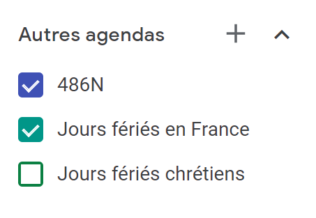

NB : ce tutoriel, bien qu'à destination des étudiants et professeurs de l'université de Nantes, fonctionnera de manière analogue pour toutes les universités (française en tout cas).

## Accéder à l'emploi du temps Web de votre Université

Pour l'Université de Nantes, le lien est le suivant :

[https://edt.univ-nantes.fr/edt](https://edt.univ-nantes.fr/edt)

Accédez ensuite à l'emploi du temps que vous souhaitez enregistrer sur Google Agenda.

Pour l'université de Nantes, cliquez sur cette icône :

EDT Université de nantes

Et copiez le lien qui s'affiche :

Lien copié !

## Ajout de l'EDT à Google Agenda

Tout d'abord, connectez-vous à Google Agenda :

[https://calendar.google.com/calendar/](https://calendar.google.com/calendar/)

Ensuite, cliquez sur le + à coté de "Autres agendas" en bas à gauche.

Autres agendas

Et sélectionnez "À partir de l'URL".

Vous pouvez maintenant coller L’URL que vous aviez copié précédemment.

Vous devriez avoir accès à votre Emploi du temps sur Google Agenda dès maintenant :). (il se peut qu'il faille alors cocher l'emploi du temps comme sur la photo ci-dessus).

## Complément

### Modifier les paramètres de l'agenda

Appuyez sur les trois points comme sur l'image suivante :

Autres agendas Paramètres

Et sélectionnez Paramètres.

C'est ici que vous pourrez modifier le Nom de votre agenda (486N pour moi), recevoir des mails, des notifications, etc.

### Installer le Widget sur Android !

Pour faciliter l'accès à cet emploi du temps, vous pouvez, sur Android, ajouter un Widget Google Agenda directement sur votre page d'accueil.

Pour ajouter un widget, la méthode classique sur Android consiste à appuyer longuement sur la page d'accueil, sélectionner "Widget" et sélectionner le widget correspondant.

### Ajout de l'agenda à Google Assistant

Vous ne le saviez peut-être pas, mais vous pouvez être réveillé par Google Assistant grâce aux routines ! Demandez à votre Google Home, "quel est mon prochain cours?"! Un Google Assistant bien configuré peut vraiment vous aider tout au long de votre journée :).

(étapes susceptibles de changer, tutoriel du 23 avril 2020)

1. Depuis l'application Google, appuyez sur "plus" en bas à droite.
2. Cliquez sur "Paramètres"
3. Assistant Google
4. Services
5. Agenda
6. Ajoutez votre nouvel Agenda!

Vous pouvez maintenant poser des questions relatives à votre emploi du temps depuis votre Google Home !

Pour paramétrer des Routines Google, je vous renvois à l'Aide Google Nest :

[Configurer et gérer des routines](https://support.google.com/googlenest/answer/7029585?co=GENIE.Platform%3DAndroid&hl=fr)

## Sources

- [https://support.google.com/calendar/answer/37118?hl=en&co=GENIE.Platform=Desktop](https://support.google.com/calendar/answer/37118?hl=en&co=GENIE.Platform=Desktop)
- [https://wiki.univ-nantes.fr/personnels:agenda:celcat](https://wiki.univ-nantes.fr/personnels:agenda:celcat)
