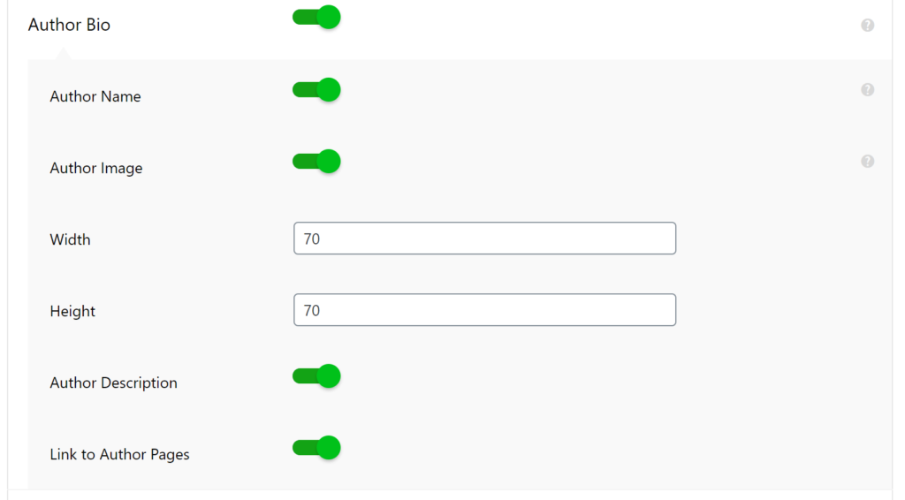

## Le problème :

On peut voir avec le screenshot suivant que _AMP for WP_ demande à Gravatar une image de taille s=70 car la taille du bloc est de taille 70 (dans notre cas).


Malheureusement, l'extension AMPforWP (actuellement en version : 1.0.53.1) ne le permet pas depuis les paramètres :




## La solution :

Accédez par la méthode de votre choix à la racine de votre site web puis ouvrez le fichier suivant (par la méthode de votre choix, SSH, FTP, ...).

~/wp-content/plugins/accelerated-mobile-pages/components/author-box/author-box.php

Remplacez (à la ligne 92 pour moi) cette partie du fichier :

```php
if ( null == $author_avatar_url ){
       $author_avatar_url = get_avatar_url( $post_author->ID, array( 'size' => $avatar_size ) );
} 
```

Par :

```php
if ( null == $author_avatar_url ){
       $avatar_new_size = $avatar_size + 100;
       $author_avatar_url = get_avatar_url( $post_author->ID, array( 'size' => $avatar_new_size ) );
} 
```

Arbitrairement, j'ai choisi de prendre une taille supérieure de 100 pixels à la taille originale. Vous pouvez bien sûr modifier ce nombre selon votre besoin.

_Note : Il faut savoir qu'une mise a jour peut effacer cette modification manuelle. Il faudra donc certainement le refaire..._
